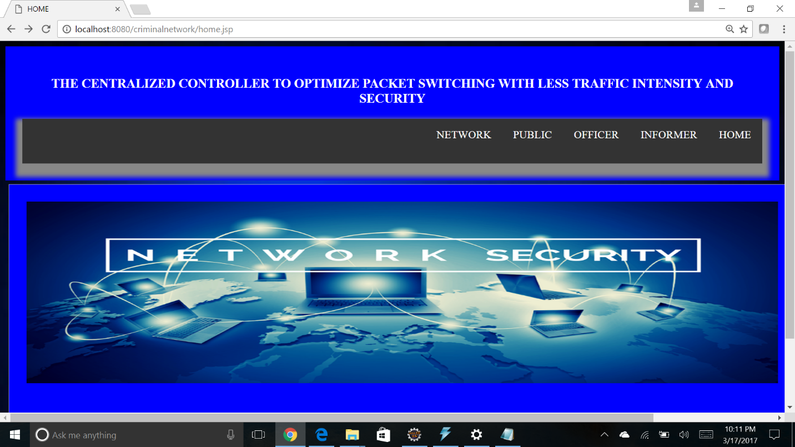
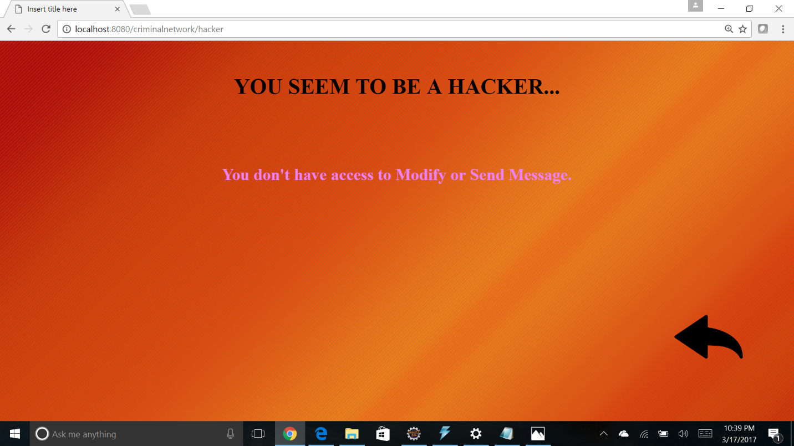
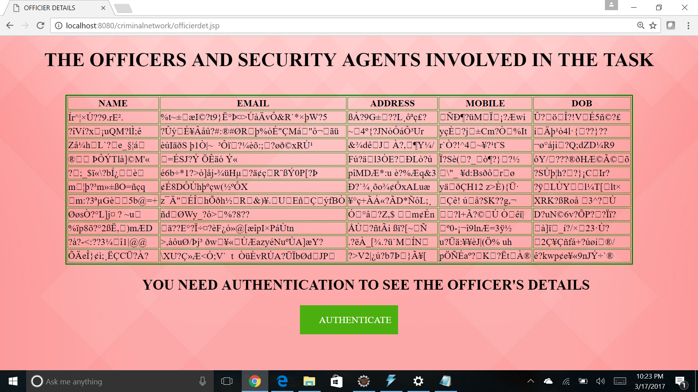

# Centralized Controller to Optimize Packet Switching

> The primary objective is to detect who has tried to hack the secret messages and in which node and notify the sender about the hack.

## Table of contents
* [Technologies](#technologies)
* [Snapshots](#snapshots)
* [Contact](#contact)

## Technologies
* Technologies - Java, JSP, MySQL, HTML5, CSS3, JavaScript

## Snapshots

 
 
  

## Contact
[Hemanth Kumar Woraram](https://hemanthkumarw.com/) - feel free to contact me!
